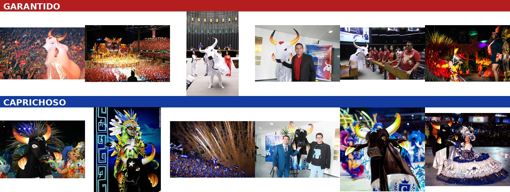
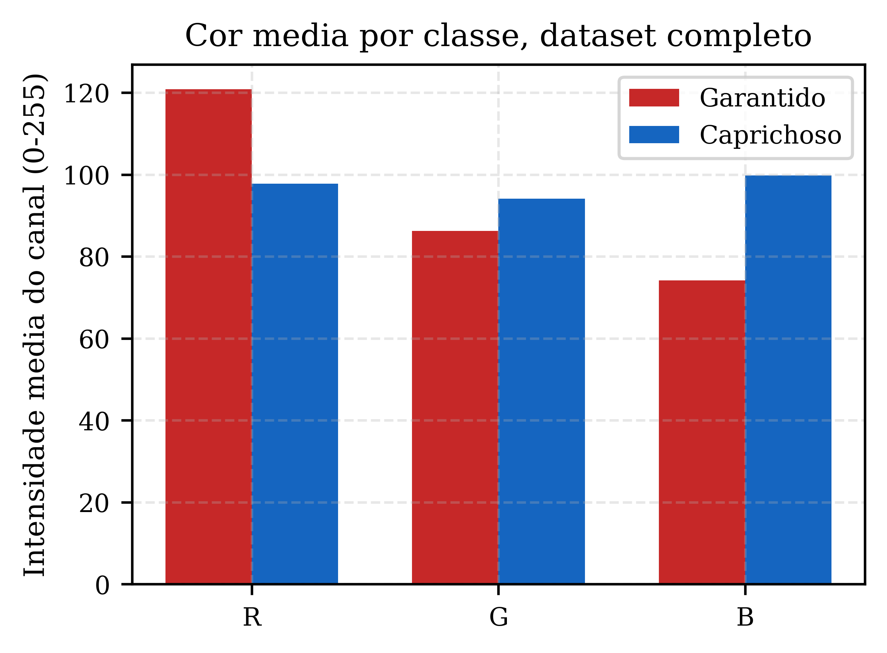

# 🐂 Transfer Learning: Garantido x Caprichoso

Projeto do desafio de código da [DIO](https://www.dio.me) sobre Transfer Learning em Deep Learning. Em vez do clássico exemplo de gatos e cachorros, apliquei o método a um tema de cultura popular brasileira: o Festival Folclórico de Parintins, no Amazonas, disputa entre os bois-bumbás Garantido, vermelho e branco, e Caprichoso, azul e branco.

## O desafio

Aplicar Transfer Learning em uma rede de Deep Learning, em Python, no Google Colab, documentando o processo em um repositório público. Ponto de partida: o notebook de referência da DIO, que faz transfer learning sobre o dataset Caltech-101. Adaptei o código para uma classificação binária com dataset próprio.

## Sobre o tema

Garantido e Caprichoso são os dois bois-bumbás que disputam, há mais de um século, o Festival de Parintins, um dos maiores eventos culturais do Brasil. Cada agremiação tem cores, símbolos e torcida muito característicos, o que as torna um bom par de classes visualmente distintas para um classificador de imagens.

| | Garantido | Caprichoso |
|---|---|---|
| Cores | Vermelho e branco | Azul e branco |
| Símbolo do boi | Cabeça branca, coração vermelho na testa | Cabeça preta, estrela branca na testa |

### Amostras do dataset



## O que é Transfer Learning

Treinar uma rede neural do zero para reconhecer imagens exige muitos dados e poder computacional, porque a rede precisa aprender sozinha, desde o início, a reconhecer bordas, texturas, formas e só depois objetos. Transfer learning evita boa parte desse trabalho reaproveitando uma rede que já passou por esse aprendizado em um dataset gigante. Neste projeto usamos a VGG16, treinada originalmente para classificar 1000 categorias de objetos da ImageNet.

Na prática, o método funciona assim:

1. Carrega a VGG16 já treinada, com todos os pesos aprendidos.
2. Congela as camadas convolucionais, que já sabem extrair features genéricas de imagens.
3. Troca a última camada, feita sob medida para as 1000 classes da ImageNet, por uma nova camada de classificação com apenas as classes do nosso problema.
4. Treina só essa camada nova, usando o dataset pequeno que temos.

A ideia é que as features aprendidas na ImageNet, como bordas, texturas e formas, sejam úteis mesmo em domínios bem diferentes do original. O notebook compara essa abordagem com uma CNN simples treinada do zero, para servir de baseline.

## Estrutura do repositório

```
.
├── transfer_learning_garantido_caprichoso.ipynb   # notebook principal (Colab)
├── dataset/
│   ├── garantido/       # 118 imagens do boi Garantido
│   ├── caprichoso/      # 107 imagens do boi Caprichoso
│   └── README.md        # fonte e licença das imagens
└── results/              # gráficos e métricas gerados pelo notebook, 600 DPI
```

## Como executar

1. Abra `transfer_learning_garantido_caprichoso.ipynb` no [Google Colab](https://colab.research.google.com/).
2. Clone este repositório, o dataset já vem incluso, ou monte o seu próprio seguindo [`dataset/README.md`](dataset/README.md).
3. Execute as células em ordem: baseline, VGG16 congelada, treino, avaliação, predição.

## Resultados

Treino final com as 225 imagens do dataset, split estratificado 70/15/15, o que dá 35 imagens de teste. 40 épocas com early stopping, class weights para compensar o pequeno desbalanceamento entre as classes e data augmentation leve no treino.

| Modelo | Acurácia | Precisão | Recall (sensibilidade) | F1-score |
|---|---|---|---|---|
| Baseline, do zero | 0.914 | 0.917 | 0.911 | 0.913 |
| Transfer Learning, VGG16 | 0.771 | 0.773 | 0.775 | 0.771 |

O baseline treinado do zero superou o Transfer Learning. Esse resultado chamou atenção o suficiente para investigar a fundo se havia algum problema no dataset ou no experimento. A análise está na próxima seção.

Gráficos completos, curvas de loss e acurácia, matriz de confusão, curva ROC e comparação de métricas, estão em [`results/`](results/), todos gerados a 600 DPI.

## Diagnóstico: por que o baseline superou o Transfer Learning

O primeiro instinto ao ver um baseline simples vencer uma rede pré-treinada é suspeitar de vazamento de dados, ou seja, a mesma imagem ou uma quase idêntica aparecendo tanto no treino quanto no teste, o que deixaria os números artificialmente altos. Testei essa hipótese diretamente.

**Verificação de vazamento.** Recalculei o split de treino, validação e teste usando exatamente a mesma semente aleatória do notebook, e comparei as 225 imagens entre si usando perceptual hashing, técnica que mede o quão visualmente parecidas duas imagens são, mesmo com recortes ou compressões diferentes. A menor distância encontrada entre qualquer par de imagens do dataset inteiro foi de 10 em uma escala de 0 a 64, e nenhum par próximo caiu em lados opostos do split. Não há vazamento de dados por duplicata ou quase duplicata.

**O que realmente explica o resultado.** O dataset entrega um atalho de cor muito forte, e é isso que o baseline está explorando.



A cor média das imagens de Garantido tem o canal vermelho bem acima dos outros dois. A cor média das imagens de Caprichoso é mais neutra, com leve predominância de azul. Essa diferença é grande o suficiente para uma CNN rasa aprender a separar as classes quase só olhando a estatística de cor da imagem inteira, sem precisar entender forma, contexto ou conteúdo.

Isso também explica por que a VGG16 perde para o baseline aqui. Ela foi pré-treinada para reconhecer objetos pela forma e pela textura, não pela cor média da imagem. Com as camadas convolucionais totalmente congeladas, só a última camada é treinada, e ela não consegue recalibrar a sensibilidade a cor das camadas anteriores. O resultado não é uma falha do método, é um descompasso entre o que a rede pré-treinada sabe fazer bem e o que este problema específico pede.

**Verificação do orçamento de treino.** Outra hipótese razoável era viés de número de épocas: no log, o baseline parou na época 20 e o Transfer Learning na época 32, o que parece dar mais treino a um dos dois. Na prática os dois usaram exatamente a mesma regra, `epochs=40` com `EarlyStopping(patience=8, restore_best_weights=True)`, e cada um parou sozinho ao ficar 8 épocas sem melhorar seu `val_loss`. Como os pesos restaurados são sempre os da melhor época, o que importa é comparar esses pontos: o baseline atingiu `val_loss` de 0.178 na época 12, e o Transfer Learning nunca passou de 0.427, atingido na época 24, doze épocas depois de o baseline já ter parado. Da época 18 até a 32 o `val_loss` do Transfer Learning só oscila entre 0.43 e 0.47, sem tendência de queda, sinal de que já tinha estabilizado. Não é falta de tempo de treino, é o mesmo atalho de cor que ele não consegue explorar.

Outros dois fatores menos relevantes, mas que valem registro:

- Cerca de 19% das imagens de Caprichoso vêm de uma única sessão de fotos, mesmo fotógrafo e mesmo evento. Não é duplicata, mas pode carregar um viés leve de iluminação ou fundo daquele dia específico.
- O conjunto de teste tem só 35 imagens. Duas ou três imagens classificadas de forma diferente já mudam a acurácia em vários pontos percentuais, então os números absolutos devem ser lidos com cautela.

## O que fica de aprendizado

Transfer learning não é bala de prata. O ganho depende de quão bem as features da rede pré-treinada se alinham com o sinal que realmente separa as classes do seu problema. Quando esse sinal é algo simples e global, como cor, uma rede rasa treinada do zero pode aprender mais rápido e generalizar melhor, dentro do próprio dataset, do que uma rede grande usada só como extratora de features fixas.

Isso não invalida a técnica. Em problemas onde a diferença entre classes está em forma, textura ou composição de objetos, que é o tipo de conhecimento que a ImageNet realmente ensina, transfer learning costuma vencer com folga um baseline pequeno, especialmente com poucos dados. O próximo passo natural aqui seria destravar as últimas camadas convolucionais da VGG16 para fine-tuning, em vez de mantê-las 100% congeladas, e ver se a rede consegue recalibrar a sensibilidade a cor.

Outros aprendizados do processo:

- Curadoria de dataset importa mais que volume bruto. Boa parte do trabalho neste projeto foi remover imagens mineradas de fontes públicas que continham os dois bois na mesma foto, ou nenhum boi visível.
- Um resultado que parece bom demais, ou ruim demais, merece investigação antes de virar conclusão. Vazamento de dados era a hipótese óbvia aqui, e os dados mostraram que não era o caso.
- Dataset pequeno e levemente desbalanceado pede split estratificado, class weights e augmentation leve. Sem isso as métricas de validação ficam bem instáveis entre épocas.

## Créditos

- Notebook base: material de apoio do desafio Transfer Learning da formação em Deep Learning, [DIO](https://www.dio.me).
- Imagens: [Wikimedia Commons](https://commons.wikimedia.org) e [Openverse](https://openverse.org) via Flickr, fotos da Assembleia Legislativa do Amazonas. Fontes e licenças detalhadas em [`dataset/README.md`](dataset/README.md).
